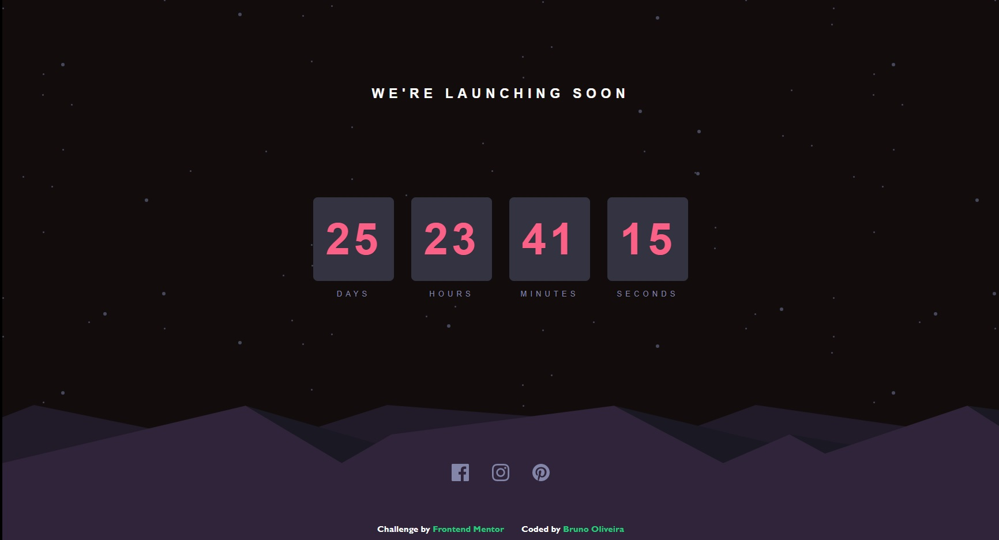

## 📝 Desafio launch-countdown-timer
Projeto de desafio do frontend mentor para construção de um cronômetro de contagem regressiva

<h4><a href="https://www.frontendmentor.io/challenges/launch-countdown-timer-N0XkGfyz-">Link do desafio</a></h4>

## 💻 Screenshot do projeto

- Designer 01

<h4 align="center"><a href="https://brunooliveira16.github.io/launch-countdown-timer/">Clique aqui e visite o projeto</a></h4>

## 📚 Descrição

Construir um cronômetro de contagem regressiva e fazê-lo parecer o mais próximo possível do design do desafio.
- **Layout Responsivo:** Visualize o layout ideal para o site, dependendo do tamanho da tela do dispositivo;
- **Interação dos elementos:** Veja os estados de foco para todos os elementos interativos na página;
- **Cronômetro:** Veja um cronômetro de contagem regressiva ao vivo que diminui a cada segundo;
---

## 💼 Tecnologias utilizadas

- HTML;
- CSS;
- JavaScript;

---
## 🙋🏻‍♂️ Autor

Bruno Oliveira
